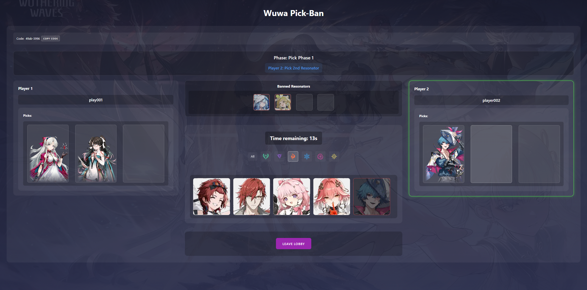
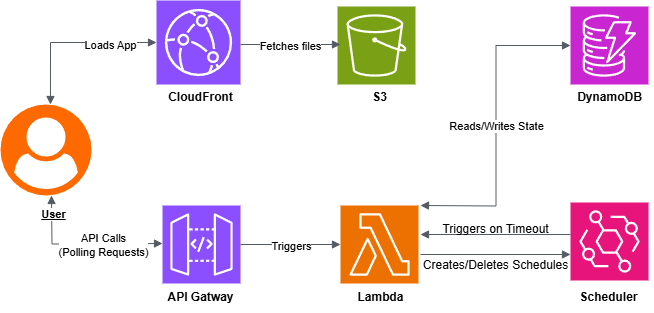

# 🎮 Wuthering Waves - AWS Serverless Pick/Ban Lobby

 
A fan-made web-based system simulating a "Pick/Ban" phase for the game Wuthering Waves. While the game is primarily a solo experience, this tool allows friends or communities to create custom challenges (e.g., banning strong characters before boss fights) by adding a team drafting phase. It is built using AWS serverless components and Vanilla JavaScript.

**Note:** This project was developed primarily using AI tools as an experiment in AI-assisted development by someone who is **not a developer or programmer**. See the [Development Process & AI Usage](#development-process--ai-usage) section for details.

## 🗺️ Table of Contents

- [Overview](#overview)
- [Features](#features)
- [Architecture](#architecture)
  - [Backend (AWS Serverless)](#backend-aws-serverless)
  - [Frontend (Vanilla JS)](#frontend-vanilla-js)
  - [Communication Flow](#communication-flow)
- [Development Process & AI Usage](#development-process--ai-usage) 
- [Live Demo](#live-demo) 
- [Setup & Deployment](#setup--deployment)
  - [Prerequisites](#prerequisites)
  - [Backend Deployment](#backend-deployment)
  - [Frontend Deployment (S3 & CloudFront)](#frontend-deployment)
  - [Configuration](#configuration)
- [Usage](#usage)
- [Known Issues & Limitations](#known-issues--limitations)
- [Future Improvements](#future-improvements)
- [Contributing](#contributing) 
- [License](#license) 
- [Acknowledgements](#acknowledgements) 

## ℹ️ Overview

This project provides a functional simulation of the Wuthering Waves Resonator pick/ban phase, intended for community use (e.g., tournaments, friend challenges) rather than reflecting an in-game competitive mode. It allows an organizer to create a lobby, two players to join, perform a ready check, and proceed through a timed, multi-stage pick/ban sequence. The backend is powered entirely by AWS serverless services for scalability and cost-efficiency, while the frontend uses plain HTML, CSS, and JavaScript.

*(Added Note)*
This project represents an experiment in leveraging AI for software development, particularly for someone without prior programming or AWS experience. See the [Development Process & AI Usage](#development-process--ai-usage) section for more details on the tools and process used.

## ✨ Features

* **Lobby Creation & Joining:** Organizers create lobbies with unique codes; players join using the code.
* **Organizer Role:** Organizer can create, delete, reset the lobby, and optionally join as a player.
* **Ready Check:** Ensures both players are ready before starting the pick/ban phase.
* **Multi-Stage Pick/Ban:** Implements the specific pick/ban sequence (Ban1 -> Pick1 -> Ban2 -> Pick2).
* **Turn Timers:** Each pick/ban action is timed using AWS EventBridge Scheduler.
* **Timeout Handling:** If a player times out, a random available Resonator is automatically selected/banned.
* **Real-time (Polling):** Frontend polls the backend to update the lobby state.
* **Resonator Filtering:** Filter the character grid by element.
* **Visual Feedback:** Highlights active player turns, shows selected/banned Resonators, displays timer status.
* **Automatic Cleanup:** DynamoDB TTL automatically removes inactive lobbies after a set period (e.g., 24 hours).
* **Basic Disconnect Handling:** `beforeunload` event attempts cleanup (best-effort).

## 🏗️ Architecture

This project uses a serverless backend hosted on AWS and a static frontend built with Vanilla JavaScript.

 

### Backend (AWS Serverless)

The backend is composed of several managed AWS services working together:

* **API Gateway (REST):** Acts as the front door for all HTTP requests from the frontend. It defines API endpoints (like `/lobbies`, `/lobbies/{lobbyCode}/action`) and routes incoming requests to the appropriate Lambda function based on the path and HTTP method (GET, POST, DELETE).
* **AWS Lambda (Python):** A collection of small, single-purpose functions that contain the core application logic. Each function handles a specific task:
    * *Lobby Management:* Creating (`createLobby.py`), joining (`joinLobby.py`, `organizerJoin.py`), leaving (`pickban-leaveLobby.py`), deleting (`deleteLobby.py`), and resetting (`pickban-resetLobby.py`) lobbies.
    * *State Management:* Retrieving the current lobby state (`getLobby.py`), handling ready checks, and processing pick/ban actions (`makePick.py`).
    * *Timeout Logic:* Handling timer expirations (`handleTimeout.py`).
    These functions interact with DynamoDB to persist state and with EventBridge Scheduler to manage timers.
* **DynamoDB:** A NoSQL database used as the primary data store. A single table holds the state for all active lobbies, uniquely identified by a `lobbyCode`. It stores information like player names, readiness status, current game state (`gameState`), lists of picks and bans, timer details (`timerState`), and the organizer's name. A Time-to-Live (TTL) attribute (`ttl`) is set on each lobby item to enable automatic cleanup of old lobbies by DynamoDB itself.
* **EventBridge Scheduler:** Used to implement the turn timers. When a pick/ban turn starts (`makePick.py`, `getLobby.py`), a one-time schedule is created to trigger the `handleTimeout.py` Lambda function after the specified duration (e.g., 30 seconds). If a player makes their move before the timer expires, the corresponding schedule is deleted (`makePick.py`). If the timer expires, the schedule triggers `handleTimeout.py` to perform a random action and advance the game state.
* **S3 (Simple Storage Service):** Used in two ways:
    1.  To host the static frontend web application files (`index.html`, `styles.css`, `script.js`).
    2.  To host shared data like the `resonators.json` file and all necessary images (icons, character portraits, etc.). The `handleTimeout.py` Lambda function reads `resonators.json` from S3 to know which characters are available for random selection.
* **CloudFront:** A Content Delivery Network (CDN) placed in front of the S3 bucket hosting the frontend. It provides HTTPS access, caches the static files closer to users for faster loading, and serves the application via a `*.cloudfront.net` URL.
* **IAM (Identity and Access Management):** Defines the permissions that allow these services to interact securely (e.g., API Gateway invoking Lambda, Lambda accessing DynamoDB/Scheduler/S3, Scheduler invoking Lambda).

### Frontend (Vanilla JS)

The frontend is a single-page application built without any frameworks:

* **HTML (`index.html`):** Provides the basic structure of the application, including the initial join/create screen and the main lobby view with placeholders for player info, picks, bans, the timer, filters, and the character grid.
* **CSS (`styles.css`):** Defines the visual appearance, layout (using CSS Grid and Flexbox), dark theme, button styles, responsiveness, and visual cues for different game states (like highlighting the active player or graying out picked/banned characters).
* **JavaScript (`script.js`):** Contains all the client-side logic:
    * Handles user interactions (button clicks, input).
    * Makes asynchronous calls to the backend API Gateway endpoints to create/join lobbies, send actions, and fetch state.
    * Manages local application state (like the current `lobbyCode`, `playerName`, and `role`) using `localStorage`.
    * Periodically fetches the latest lobby state from the backend using `setInterval` (polling the `getLobby` endpoint).
    * Updates the HTML DOM dynamically based on the fetched state (displaying player names, picks, bans, game phase, timer, etc.).
    * Implements client-side filtering for the character grid.
    * Displays a client-side countdown timer synchronized (as closely as possible) with the backend timer state.
    * Includes a `beforeunload` event listener as a best-effort attempt to notify the backend if the user closes the tab/browser.
* **Data (`resonators.json`):** A static JSON file, fetched by the frontend from S3/CloudFront at startup, containing details about each Resonator (ID, name, element, image URLs, etc.) needed to populate the character grid and display picks/bans correctly.

### Communication Flow

1.  User loads the frontend application from S3 via the CloudFront URL.
2.  `script.js` fetches `resonators.json`.
3.  User interacts with the UI (e.g., clicks "Create Lobby").
4.  `script.js` sends a request to the corresponding API Gateway endpoint.
5.  API Gateway triggers the appropriate Lambda function (e.g., `createLobby.py`).
6.  Lambda interacts with DynamoDB (e.g., creates item) and potentially EventBridge Scheduler (e.g., `makePick.py` creates a timeout schedule).
7.  Lambda returns a response (e.g., the new `lobbyCode`) via API Gateway to the frontend.
8.  `script.js` uses `setInterval` to periodically call the `getLobby` endpoint via API Gateway.
9.  `getLobby.py` Lambda retrieves the current state from DynamoDB and returns it.
10. `script.js` receives the state and updates the HTML elements (player names, picks, bans, game phase text, timer display, button styles) accordingly.

## 🤖 Development Process & AI Usage 
This project serves as a practical experiment exploring the capabilities of AI in software development, particularly for an individual starting with no prior background in programming or AWS cloud services.

**Transparency:**

* **100% AI-Generated Code:** The entire codebase, including the backend Python Lambda functions, frontend JavaScript, HTML structure, and CSS styling, was generated by AI tools.
* **AI Tools Used:**
    * **Gemini 2.5 Pro:** Utilized for initial planning, designing the serverless architecture, brainstorming solutions to challenges (like state management, timers, disconnects), and debugging conceptual issues or code snippets.
    * **Cursor AI:** Employed for implementing the code directly into the project files based on the plans and logic discussed with the conversational AI.
* **Developer Role:** My role (as someone who is not a developer/programmer) focused on defining the project requirements, prompting the AI tools, evaluating the generated architecture and code, identifying issues or areas needing refinement, and guiding the AI through iterations and debugging based on testing and AI feedback.
* **Choice of IAM Permissions:** For simplicity during this AI development experiment, I applied the `AmazonDynamoDBFullAccess` managed policy to **all** Lambda functions requiring database access, instead of crafting more fine-grained, least-privilege permissions. While I recognize this is **not recommended as a best practice** (which favors least privilege), I chose this approach to reduce complexity while testing the AI's ability to handle the core application logic, given my unfamiliarity with specific IAM policy creation.
* **Polling vs. WebSockets:** I chose a polling mechanism (`setInterval` on the frontend) for fetching state updates instead of WebSockets. This decision was driven by my preference for a simpler request/response model during this AI development experiment and my uncertainty about the AI's ability to implement and manage persistent WebSocket connections effectively. This choice directly led to some of the project's known limitations, such as the delay in seeing opponent actions (polling interval), the latency in timeout handling (reliance on EventBridge Scheduler), and the challenges with reliably detecting user disconnects. See [Known Issues & Limitations](#known-issues--limitations).
* **Goal:** Beyond creating a functional Pick/Ban lobby for Wuthering Waves, the primary objective was to understand the extent to which current AI tools can facilitate the creation of a relatively complex, full-stack application from concept to deployment for a novice user.

This context is provided for transparency regarding the project's origins and development methodology.

## 🚀 Live Demo

You can try the live application here:
[**Wuthering Waves Pick/Ban Lobby**](https://d23g90uwgh8nfk.cloudfront.net/)

## 🛠️ Setup & Deployment

### Prerequisites

* AWS Account
* AWS Console Access
* Python 3.10.9 (or compatible version for Lambda runtime)

### Backend Deployment

This project's backend was deployed manually using the **AWS Management Console**. The general steps involved are:

1.  **DynamoDB:** Create the DynamoDB table (e.g., `MyLobbyTable`) with `lobbyCode` (String) as the partition key. Enable Time-to-Live (TTL) on the `ttl` attribute via the console settings. *Remember to use the actual table name you create when configuring Lambda environment variables.*
2.  **IAM Roles:**
    * Create an IAM Role for the Lambda functions granting permissions for DynamoDB actions (`GetItem`, `PutItem`, `UpdateItem`, `DeleteItem`), EventBridge Scheduler actions (`CreateSchedule`, `DeleteSchedule`), S3 `GetObject` (for `resonators.json`), and CloudWatch Logs (`CreateLogGroup`, `CreateLogStream`, `PutLogEvents`). Using managed policies like `AmazonDynamoDBFullAccess` is simpler but less secure than custom policies; choose based on your comfort level. Note the ARN of this role.
    * Create another IAM Role specifically for EventBridge Scheduler to assume, granting it permission to invoke the `handleTimeout` Lambda function (`lambda:InvokeFunction`). Note the ARN of this role.
3.  **Lambda Functions:** For each Python (`.py`) file in the backend code:
    * Create a new Lambda function in the AWS Console (using a Python runtime, e.g., Python 3.10).
    * Upload the corresponding `.py` file's code (e.g., copy-paste or upload zip).
    * Assign the Lambda execution role created in step 2.
    * Configure the necessary Environment Variables (under Configuration -> Environment variables) using the exact names of *your* created resources (see [Configuration](#configuration) section below). E.g., set `TABLE_NAME` to the name you chose for your DynamoDB table.
4.  **API Gateway (REST API):**
    * Create a new REST API in the API Gateway console.
    * Create resources matching the required paths (e.g., `/lobbies`, `/lobbies/{lobbyCode}`, `/lobbies/{lobbyCode}/action`, etc.). Use `{lobbyCode}` for path parameters where needed.
    * For each resource, create the necessary HTTP methods (e.g., POST on `/lobbies`, GET/POST on `/lobbies/{lobbyCode}`, POST on `/lobbies/{lobbyCode}/action`, etc.).
    * For each method, configure the integration to point to the corresponding Lambda function created in step 3 (using Lambda Proxy integration is often simplest).
    * Enable CORS (Cross-Origin Resource Sharing) for the necessary methods/resources (often via the "Enable CORS" action in the console) to allow requests from your frontend domain.
    * Deploy the API to a stage (e.g., `dev`). Note the generated Invoke URL.
5.  **EventBridge Scheduler:** While schedules are created/deleted *dynamically* by the `makePick` and `getLobby` Lambda functions, ensure the necessary IAM permissions are in place (as configured in step 2) for those functions to interact with the Scheduler service. No manual schedule creation is needed here.

*(Note: Detailed step-by-step console screenshots or guides are beyond the scope of this README, but the above outlines the services and general configuration performed manually via the AWS Console.)*

### Frontend Deployment (S3 & CloudFront)

1.  Create an S3 bucket. Choose a unique name.
2.  Enable static website hosting on the bucket (note the endpoint).
3.  Upload `index.html`, `styles.css`, `script.js`, `resonators.json`, and the `images` folder to the bucket using the AWS Console. Ensure public read access *or* configure CloudFront OAI.
4.  Update the `apiBaseUrl` constant in `script.js` with your deployed API Gateway Invoke URL. Re-upload `script.js`.
5.  Create a CloudFront distribution via the AWS Console:
    * Origin: S3 bucket website endpoint (or REST API endpoint if using OAI).
    * Default Root Object: `index.html`.
    * Configure cache behavior (e.g., forward headers if needed for API).
    * (Optional) Configure Origin Access Identity (OAI) for secure S3 access.
6.  Access the application via the CloudFront domain name.

### Configuration

* **`script.js`:** Update `apiBaseUrl` with your specific API Gateway Invoke URL.
* **Lambda Environment Variables:** Ensure the following are correctly set via the Lambda console for the relevant functions:
    * `TABLE_NAME`: The exact name of *your* DynamoDB table.
    * `HANDLE_TIMEOUT_LAMBDA_ARN`: The ARN of *your* deployed `handleTimeout` Lambda function.
    * `LAMBDA_EXECUTION_ROLE_ARN`: The ARN of the IAM Role created for EventBridge Scheduler to invoke Lambda.
    * `S3_BUCKET_NAME`: The name of *your* S3 bucket containing `resonators.json`.
    * `S3_FILE_KEY`: The key (path) to `resonators.json` in your S3 bucket (usually just `resonators.json` if it's in the root).
* **(Optional) `resonators.json`:** Update with new characters or image URLs as needed. Must be re-uploaded to S3.

## ▶️ Usage

1.  Navigate to the CloudFront URL.
2.  **Organizer:** Enter a name and click "Create New Lobby".
3.  Share the displayed Lobby Code with the other player.
4.  *(Optional)* Organizer clicks "Join as Player" to take a player slot.
5.  **Player 2:** Enters their name, the Lobby Code, and clicks "Join Lobby".
6.  Once both players are in, the "Ready Check" phase begins. Both players click "Ready".
7.  The Pick/Ban phase starts automatically, following the sequence indicated by the phase/turn display.
8.  Click on an available Resonator button in the grid to make your pick or ban during your turn.
9.  The process continues until the "Complete" state is reached.
10. **Organizer Controls:** Use "Reset Lobby" to clear picks/bans and return to Ready Check, or "Delete Lobby" to remove it entirely.
11. **Player Controls:** Use "Leave Lobby" to exit (this also resets the lobby state).

## ⚠️ Known Issues & Limitations

* **Polling Delay:** UI updates are not instantaneous due to the 3-second polling interval.
* **Timeout Latency:** Backend timeout processing via EventBridge/Lambda can have a noticeable delay (8-30+ seconds). Optimistic UI (⏳) helps mask this visually.
* **Disconnect Handling:** `beforeunload` is unreliable; players abruptly disconnecting might remain "stuck" until TTL cleanup or manual reset/delete.
* **Mobile Responsiveness:** CSS requires further work for optimal display on small screens.
* **Stateless Complexity:** Managing game flow across stateless Lambdas adds complexity compared to stateful connections (e.g., WebSockets).

## 💡 Future Improvements

* Implement WebSockets for true real-time updates.
* Explore AWS Step Functions as a potentially more robust and faster alternative to EventBridge Scheduler for handling timeouts **(relevant for the current polling architecture)**.
* Implement a heartbeat mechanism for reliable disconnect detection.
* Improve mobile CSS layout.
* Allow customization of timer durations, number of picks/bans,etc...

## 🙌 Contributing

As this project was primarily an experiment in AI-assisted development by a non-programmer, I'm not actively seeking direct code contributions (Pull Requests) at this time.

However, I would be very interested to hear feedback from players who find this tool fun or useful! If you have:
* Ideas for new features
* Suggestions for improvements (especially related to gameplay or usability)
* Bug reports

Please feel free to **open an issue** on the GitHub repository to share your thoughts.

## 📜 License

This project is licensed under the terms of the MIT License. You can view the full license text here: [https://opensource.org/licenses/MIT](https://opensource.org/licenses/MIT)

## 🙏 Acknowledgements

* Wuthering Waves for the game concept.
* AI Tools (e.g., Gemini, Cursor AI) for assistance in architecture, coding, and debugging.